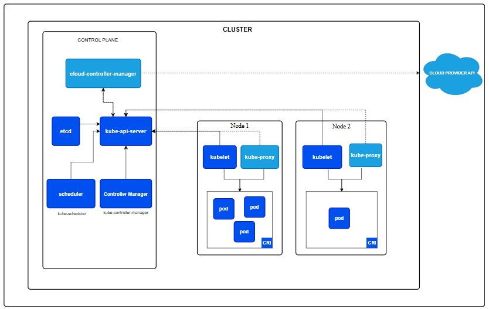

# Kubernetes ☸️

##  Why is Kubernetes needed
- Kubernetes addresses the challenges of managing containerized applications at scale.
- It automates the deployment, scaling, and operation of application containers across clusters of hosts.
- Without Kubernetes, managing multiple containers and ensuring they communicate, scale, and stay up can be complex and error-prone.

## Benefits of Kubernetes
- **Rollback changes**
- **Load-Balancing**
- **Open-source**
- **Self-Healing**
- **Scalability** 📈: Automatically scales applications up or down based on demand.
- **Resource Optimization** 💸: Efficiently uses infrastructure, ensuring applications have necessary resources without over-provisioning.
- **Portability** 🚀: Works across various environments (cloud, on-premise, hybrid).
- **High Availability** 🔄: Ensures application uptime with self-healing and load-balancing.
- **Streamlined CI/CD** 🛠️: Supports continuous integration and deployment, enabling faster delivery cycles.

## Success Stories
- Spotify 🎶: Improved service uptime and reduced deployment times.
- Airbnb 🏡: Achieved better resource utilization and easier scaling.
- Google 🌐: Developed Kubernetes (inspired by its internal Borg system) to manage its massive infrastructure.
  
## Kubernetes Architecture (include a diagram)
- **Control Plane Components** ⚙️:
  - **API Server** 📡: Exposes Kubernetes API; the main management interface.
  - **etcd** 🗃️: Stores all cluster data, ensuring consistent state across the system.
  - **Controller Manager** 🕹️: Ensures that the cluster’s desired state is met.
  - **Scheduler** 📅: Assigns workloads to nodes based on resource availability.
- Worker Nodes 💻:
  - **Kubelet** 👾: Agent on each node, ensuring containers are running as expected.
  - **Kube-proxy** 🔗: Manages networking for each node.
  - **Container Runtime** 🐋: Responsible for running containers (e.g., Docker).

## The Cluster Setup

### What is a cluster
- A **cluster** is a group of servers (or nodes) that work together to manage and deploy containerized applications, providing redundancy and scalability 
  
### Master vs worker nodes
- **Master Nodes** 🧠: Handle cluster management, including scheduling, controlling, and monitoring.
- **Worker Nodes** 🛠️: Run the application workloads in containers, managed by the control plane.

### Pros and cons of using managed service vs launching your own

- **Managed Service** (e.g., GKE, EKS, AKS):
    - **Pros** ✅: Reduced operational overhead, automatic updates, integrated security, and simplified scaling.
    - **Cons** ❌: Higher cost, limited customization, potential lock-in to a cloud provider.
- **Self-Launched Kubernetes Cluster**:
    - **Pros** ✅: Complete control over configurations, flexibility to tailor infrastructure.
    - **Cons** ❌: Requires maintenance and expertise, increased responsibility for security and updates.

### Control plane vs data plane
- **Control Plane** 🛂: Manages the cluster’s overall state, workload scheduling, and updates.
- **Data Plane** 🛣️: Runs on the worker nodes, executing the applications and handling network traffic.
  
## Kubernetes objects 

### Research the most common ones, e.g. Deployments, ReplicaSets, Pods
- **Pods** 🧩: Smallest unit in Kubernetes, contains one or more containers.
- **ReplicaSets** 📈: Ensures a specified number of pod replicas are running.
- **Deployments** 🔄: Manages ReplicaSets, allowing rolling updates and rollbacks for applications.
  
### What does it mean a pod is "ephemeral"
- **Ephemeral** means that pods are temporary by nature; they can be terminated, rescheduled, or replaced by Kubernetes for reasons such as node failure or workload balancing .
- **Implication** : Applications must be designed to handle this ephemeral nature, often by storing data in persistent storage rather than within the pod itself.

## How to mitigate security concerns with containers
- **Image Scanning** 🔍: Regularly scan container images for vulnerabilities.
- **Network Policies** 🚧: Limit network access between pods to minimize attack surface.
- **Role-Based Access Control (RBAC)** 🛡️: Define and control permissions within the cluster.
- **Namespace Isolation** 🏢: Separate environments within the cluster for different applications or teams.
- **Use Trusted Sources** 🔒: Only deploy images from reliable and secure repositories.

## Maintained images

### What are they
- **Maintained Images** are pre-built, regularly updated container images provided by a third party (e.g., Docker Official Images or Red Hat Universal Base Images) 🧱.
- **Examples** 🚀: These images are typically minimal yet optimized, with frequent security and stability updates.

### Pros and cons of using maintained images for your base container images

- **Pros** ✅:
    - **Security** 🔐: Regularly updated to address vulnerabilities.
    - **Reliability** 🤝: Usually tested and optimized for stability and performance.
    - **Reduced Maintenance** 🛠️: Less need to manually update and maintain the base OS or runtime environment.
- **Cons** ❌:
    - **Limited Customization** 🖋️: Often configured with default settings, which may not fit all needs.
    - **Dependency on External Updates** 🕑: Relying on external maintainers for timely updates could be risky if updates are delayed.