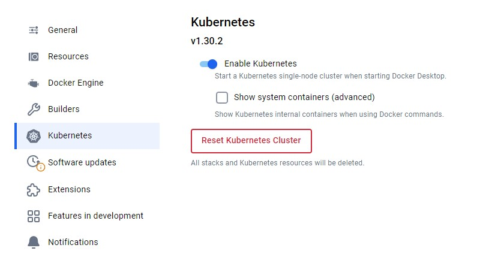
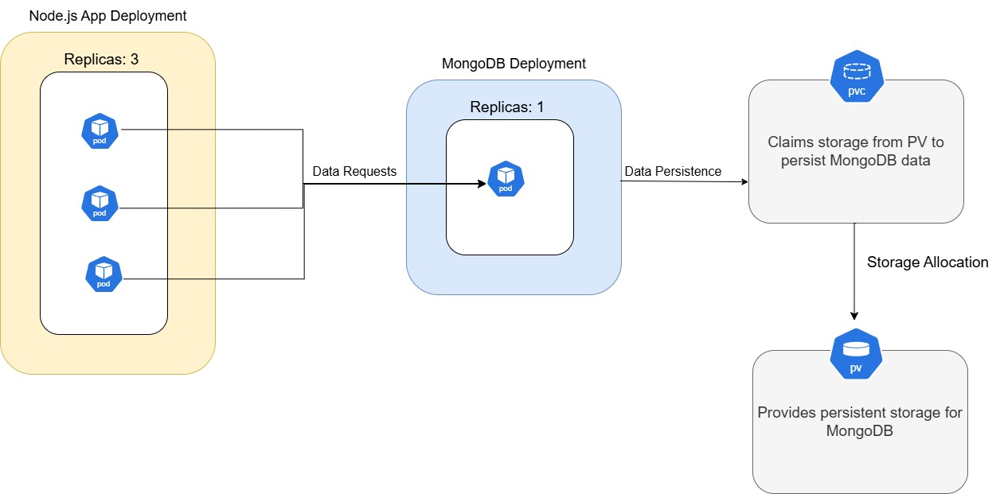

# Kubernetes ☸️


##  Why is Kubernetes needed
- Kubernetes addresses the challenges of managing containerized applications at scale.
- It automates the deployment, scaling, and operation of application containers across clusters of hosts.
- Without Kubernetes, managing multiple containers and ensuring they communicate, scale, and stay up can be complex and error-prone.


## Benefits of Kubernetes
- **Rollback changes**
- **Load-Balancing**
- **Open-source**
- **Self-Healing**
- **Scalability** 📈: Automatically scales applications up or down based on demand.
- **Resource Optimization** 💸: Efficiently uses infrastructure, ensuring applications have necessary resources without over-provisioning.
- **Portability** 🚀: Works across various environments (cloud, on-premise, hybrid).
- **High Availability** 🔄: Ensures application uptime with self-healing and load-balancing.
- **Streamlined CI/CD** 🛠️: Supports continuous integration and deployment, enabling faster delivery cycles.

## Success Stories
- Spotify 🎶: Improved service uptime and reduced deployment times.
- Airbnb 🏡: Achieved better resource utilization and easier scaling.
- Google 🌐: Developed Kubernetes (inspired by its internal Borg system) to manage its massive infrastructure.
  
## Kubernetes Architecture (include a diagram)
- **Control Plane Components** ⚙️:
  - **API Server** 📡: Exposes Kubernetes API; the main management interface.
  - **etcd** 🗃️: Stores all cluster data, ensuring consistent state across the system.
  - **Controller Manager** 🕹️: Ensures that the cluster’s desired state is met.
  - **Scheduler** 📅: Assigns workloads to nodes based on resource availability.
- Worker Nodes 💻:
  - **Kubelet** 👾: Agent on each node, ensuring containers are running as expected.
  - **Kube-proxy** 🔗: Manages networking for each node.
  - **Container Runtime** 🐋: Responsible for running containers (e.g., Docker).

## The Cluster Setup

### What is a cluster
- A **cluster** is a group of servers (or nodes) that work together to manage and deploy containerized applications, providing redundancy and scalability 
- Made up with at least **one master node** , must have at **least one working node**, running on onw machine. 
- Minicub on a vm and is going to have a master node, and working one and is used for simple architecture, running simple version . 
  
### Master vs worker nodes
- **Master Nodes** 🧠: Handle cluster management, including scheduling, controlling, and monitoring.
- **Worker Nodes** 🛠️: Run the application workloads in containers, managed by the control plane.

### Pros and cons of using managed service vs launching your own

- **Managed Service** (e.g., GKE, EKS, AKS):
    - **Pros** ✅: Reduced operational overhead, automatic updates, integrated security, and simplified scaling.
    - **Cons** ❌: Higher cost, limited customization, potential lock-in to a cloud provider.
- **Self-Launched Kubernetes Cluster**:
    - **Pros** ✅: Complete control over configurations, flexibility to tailor infrastructure.
    - **Cons** ❌: Requires maintenance and expertise, increased responsibility for security and updates.
  
- AKS take care of master node, dont charge for master node , youi pay for worker node and is separated from master node 
- EKS/GKE charge for master node too 

### Control plane vs data plane
- **Control Plane** 🛂: Manages the cluster’s overall state, workload scheduling, and updates.
- **Data Plane** 🛣️: Runs on the worker nodes, executing the applications and handling network traffic.
- **for production minimum of 3 master nodes**
- **master node** works on **control plane** and **worker node** works on **data plane**

## Kubernetes objects 

### Research the most common ones, e.g. Deployments, ReplicaSets, Pods
- **Pods** 🧩: Smallest unit in Kubernetes, contains one or more containers. Has each on internal ip address, they are ephemeral - temporary , can lose data if you distroy the pods. 
- **Services** : expose your application and connects the pods. 
- **Volume** : persist storage of data of the pods , even if pods are destroyed - you dont lose data 
- **ConfigMaps and Secrets**: key value to store configuration of whats running how is running
- **Secrets** are incoded with base64 that is not the same as encrypted, can easily transformed into text 
- **NameSpace** : logical way to group resources for app, if dont specify will go to **default name space**
- **ReplicaSets** 📈: Ensures a specified number of pod replicas are running.
- **Deployments** 🔄: Manages ReplicaSets, allowing rolling updates and rollbacks for applications
 
  

### What does it mean a pod is "ephemeral"
- **Ephemeral** means that pods are temporary by nature; they can be terminated, rescheduled, or replaced by Kubernetes for reasons such as node failure or workload balancing .
- **Implication** : Applications must be designed to handle this ephemeral nature, often by storing data in persistent storage rather than within the pod itself.

## How to mitigate security concerns with containers
- **Image Scanning** 🔍: Regularly scan container images for vulnerabilities.
- **Network Policies** 🚧: Limit network access between pods to minimize attack surface.
- **Role-Based Access Control (RBAC)** 🛡️: Define and control permissions within the cluster.
- **Namespace Isolation** 🏢: Separate environments within the cluster for different applications or teams.
- **Use Trusted Sources** 🔒: Only deploy images from reliable and secure repositories.
- NEVER run container with group privileges 
- monitoring and logging the container activity 

## Maintained images

### What are they
- **Maintained Images** are pre-built, regularly updated container images provided by a third party (e.g., Docker Official Images or Red Hat Universal Base Images) 🧱.
- **Examples** 🚀: These images are typically minimal yet optimized, with frequent security and stability updates.

### Pros and cons of using maintained images for your base container images

- **Pros** ✅:
    - **Security** 🔐: Regularly updated to address vulnerabilities.
    - **Reliability** 🤝: Usually tested and optimized for stability and performance.
    - **Reduced Maintenance** 🛠️: Less need to manually update and maintain the base OS or runtime environment.
    - better documentation
    - better performance 
- **Cons** ❌:
    - **Limited Customization** 🖋️: Often configured with default settings, which may not fit all needs.
    - **Dependency on External Updates** 🕑: Relying on external maintainers for timely updates could be risky if updates are delayed.
  
# Kubernetes commands

- To **enable** the **kubernetes** go in docker desktop - **setting** and **kubernetes** 

  

- **Apply and restart**

  

## Commands
```bash
kubectl get all
```
  - this command retrieves information about all resources in the current namespace, including pods, services, deployments

```bash
kubectl get service
```
  - this command lists all services in the current namespace.


```bash
kubectl get deploy
```

```bash
kubectl get deployments
```
  - Both commands retrieve deployment details for the current namespace.


# Deploy nginx 
## Step 1
1. **create nginx script**
    ```bash
    touch nginx-deploy.yml
    ```
    ```bash
    nano nginx-deploy.yml
    ```
    ```bash
    # YAML is case sensitive
    # use space not tab
    apiVersion: apps/v1 # specify api to use for deployment
    kind: Deployment #kind of service/object you want to create
    metadata:
      name: nginx-deployment # name the deployment
    spec: 
      selector:
        matchLabels: 
          app: nginx # look for this label/tag to match with k8 service

      # create a ReplicaSet with instances/pods
      replicas: 5
      template: 
        metadata: 
          labels:
            app: nginx 
        spec:
          containers: 
          - name: nginx
            image: corinnai/tech264-nginx-cat:v1 # the image you create to run the modified nginx in container 
            ports: 
            - containerPort: 80
    ```
2. **create the nginx-deploy**
    ```bash
    kubectl create -f nginx-deploy.yml
    # deployment.apps/nginx-deployment created
    ```

    

3. **displays information about the ReplicaSets in the current namespace**
    ```bash
    kubectl get replicasets
    ```
    ```bash
    NAME                             DESIRED   CURRENT   READY   AGE
    mongo-deployment-5bb84c8ff6      1         1         1       20m
    nodejs-deployment-8668448697     3         3         0       20m
    ```

4.  **display individual pods**
    ```bash
    kubectl get pods
    ```

    


5. **delete**
    ```bash
    kubectl delete deploy nginx-deployment
    ```

6. **make the cluster accessible to outside world**(service) 
     - three methods

       - **clouster ip**
       - **load balancer service**
       - **node port service**

## Step 2
1. **create the node port service**
    ```bash
    nano nginx-service
    ```
    ```bash
      ---
      apiVersion: v1
      kind: Service
      metadata:
        name: nginx-svc
        namespace: default
      spec:
        ports:
        - nodePort: 30001 #rance is 30000-32768
          port: 80
          targetPort: 80 
        selector:
          app: nginx # this label to match service to deployment
        type: NodePort
      ```
    
2. **create the nginx-service**  
    ```bash
    kubectl create -f nginx-service.yml
    ```
3. **display the service**

    ```bash
    kubectl get services
    ```

    

4. **display pods**
    ```bash
    kubectl get pods
    ```

    

5. **delete specific pod**(k8s is self recover and is going to create another pod if deleted one)#
    ```bash
    kubectl delete pod nginx-deployment-77897d64b4-h9fkn
    ```

## How to edit deployment , the current configuration

1. **method 1**
    ```bash
    kubectl edit deploy nginx-deployment
    ```

    

2. **method nr 2** 
    ```bash
    nano nginx-deply.yml
    ```
      - make changes
      - update config : `kubectl apply -f nginx-service.yml`

3. **method 3**
    ```bash
    kubectl scale --current-replicas=5 --replicas=6 deployment.apps/nginx-deployment
    ```
## Delete 
1. **This command deletes the Kubernetes resources defined in nginx-service.yml.**
    ```bash
    kubectl delete -f nginx-service.yml
    ```
2. **This command deletes the resources defined in nginx-deploy.yml.**
    ```bash
    kubectl delete -f nginx-deploy.yml
    ```


# Task: K8s deployment of NodeJS Sparta test app

```
Pre-requisites:
You should have a Docker image that can be pulled from Docker Hub for the NodeJS Sparta test app
For the database container, you should know the maintained Docker image you need to reference.

Guidance:

Before you do it, draw a K8s architecture diagram and share it
Copy the YAML files we already used to a new folder for this deployment, but change the file names, label/tags, images used, ports
Deploy the app (3 replicas) without the database first, then
Make a another deployment folder that also includes the Mongo database (1 replica)
```

.png>)


## Step 1 : create the yml file 
1. **nodejs-deployment.yml**
```bash
apiVersion: apps/v1 # specify the API version
kind: Deployment # define the kind as a Deployment
metadata:
  name: nodejs-deployment # name the deployment
spec:
  selector:
    matchLabels:
      app: sparta-test-app # unique label for the Node.js app

  # create a ReplicaSet with instances/pods
  replicas: 3 
  template:
    metadata:
      labels:
        app: sparta-test-app 
    spec:
      containers:
      - name: nodejs-app 
        image: corinnai/sparta-test-app:v1-no-db 
        ports:
        - containerPort: 3000 
```
2. **nodejs-service.yml**
```bash
---
apiVersion: v1
kind: Service
metadata:
  name: nodejs-svc # updated service name to match the Node.js app
  namespace: default
spec:
  ports:
  - nodePort: 30002 # specify the NodePort within range 30000-32768
    port: 80 # port inside the cluster
    targetPort: 3000 # target port inside the container 
  selector:
    app: sparta-test-app # updated label to match the app label in the deployment
  type: NodePort # expose the service via NodePort for external access
```

## Step 2 
1. run the create command for both 
```bash
kubectl create -f nodejs-deployment.yml
```
```bash
kubectl create -f nodejs-service.yml
```

## Step 3
- Check if is running by going to `localhost:30002`


## Step 4 MongoDB deployment and service

1. mongo-deployment.yml
```yaml
# mongo-deployment.yml
apiVersion: apps/v1
kind: Deployment
metadata:
  name: mongo-deployment
spec:
  selector:
    matchLabels:
      app: mongo
  replicas: 1
  template:
    metadata:
      labels:
        app: mongo
    spec:
      containers:
      - name: mongodb
        image: mongodb/mongodb-community-server:7.0.6-ubuntu2204 # MongoDB Docker image
        ports:
        - containerPort: 27017
```
2. mongo-services.yml
```yaml
---
apiVersion: v1
kind: Service
metadata:
  name: mongo-service
  namespace: default 
spec:
  selector:
    app: mongo
  ports:
    - protocol: TCP
      port: 27017 # Port for MongoDB
      targetPort: 27017
  type: ClusterIP # Internal access only
```

## Step 5 connect app with db
```yaml
env:
  - name: DB_HOST
    value: mongodb://mongo-service:27017/posts
```

## Step 6 check if working
- Browser : `localhost:30002/posts` 

❓ **Blocker: Database not seeded**

  

  


- **Seeded the db**
  ```bash
  command: ["/bin/sh", "-c"]
  args: ["node seeds/seed.js && npm start app.js"]
  ```

- **Seed manually** 
    
    1. 
  ```bash
  kubectl exec -it nodejs-deployment-7788f499c4-ftrxw -- sh
  # Unable to use a TTY - input is not a terminal or the right kind of file
  ```
    2. 
  ```bash
  $ winpty kubectl exec -it nodejs-deployment-7788f499c4-ftrxw -- sh
  /usr/src/app #
  ```

    3. print the DB_HOST
  ```bash
  /usr/src/app # printenv DB_HOST
  mongodb://mongo-service:27017/posts
  ```

    4. seed the database
  ```bash
  /usr/src/app # node seeds/seed.js
  ```

  


# Task: Create 2-tier deployment with PV for database
```
Pre-requisite: You have the NodeJS app and MongoDB database working on Kubernetes, but you are not using a PV (persistent volume) yet for the database.

- Create mongo-node deploy and volume (PV and PVC).
    - Be careful you don't allocate too much storage for the PV
    - Remember to remove PV at the end (otherwise they will just stay there)

Check them using these commands:

    kubectl get pv
    kubectl get pvc

You will know you are successful if you:
    - Delete the database deployment or the database pod
    - Re-create the deployment or pod
    - The same data displays on the /posts page.

Diagram (20min) your Kubernetes architecture with the PV and PVC
    - Have logical notes/dot points on your diagram, labels
    - Then send the link for to your diagram

If time: Create a 5 min video, showing the K8 deployment working and using your diagram to explain what you've done


Links to help:

https://kubernetes.io/docs/concepts/storage/persistent-volumes/

```

## Step 1: Define the Persistent Volume (PV) and Define the Persistent Volume Claim (PVC)

1. mongo-pv.yml
    ```yaml
    apiVersion: v1
    kind: PersistentVolume
    metadata:
      name: mongo-pv
    spec:
      capacity:
        storage: 1Gi # Limiting storage to 1GiB for testing
      accessModes:
        - ReadWriteOnce
      persistentVolumeReclaimPolicy: Delete #optional
      hostPath:
        path: /data/mongo # Path on the host machine
    ```

    ```bash
    kubectl apply -f mongo-pv.yml
    ```
2. mongo-pvc.yml
    ```yaml
    apiVersion: v1
    kind: PersistentVolumeClaim
    metadata:
      name: mongo-pvc
    spec:
      accessModes:
        - ReadWriteOnce
      resources:
        requests:
          storage: 1Gi
    ```
    ```bash
    kubectl apply -f mongo-pvc.yml
    ```
  
## Step 2: Deploy MongoDB with the PVC

1. mongo-deployment.yml
    ```yaml
    ---
    apiVersion: apps/v1
    kind: Deployment
    metadata:
      name: mongo-deployment
    spec:
      selector:
        matchLabels:
          app: mongo
      replicas: 1
      template:
        metadata:
          labels:
            app: mongo
        spec:
          containers:
          - name: mongodb
            image: mongodb/mongodb-community-server:7.0.6-ubuntu2204 # MongoDB Docker image
            ports:
            - containerPort: 27017
            volumeMounts:
            - mountPath: /data/db
              name: mongo-storage
          volumes:
          - name: mongo-storage
            persistentVolumeClaim:
              claimName: mongo-pvc
    ```

    ```bash
    kubectl apply -f mongo-deployment.yml
    ```


2. mongo-service.yml
  [mongo-service.yml](k8s-deployment-sparta-app/mongo-services.yml)

     ```bash
    kubectl apply -f mongo-service.yml
    ```

## Step 3 : Verify PV and PVC Status
```bash
kubectl get pv
kubectl get pvc
```


## Step 4: Deploy the Node.js App
1. nodejs-deployment.yml [nodejs-deployment](k8s-deployment-sparta-app/nodejs-deployment.yml)
2. nodejs-service.yml [nodejs-service.yml](k8s-deployment-sparta-app/nodejs-service.yml)

```bash
kubectl apply -f nodejs-deployment.yml

kubectl apply -f nodejs-service.yml
```
## Step 5: Seed the database manually 
```bash
winpty kubectl exec -it nodejs-deployment-7b48789698-hmqm5 -- sh
#nodejs-deployment-7b48789698-hmqm5 - name of one node 
```


```bash
/usr/src/app # node seeds/seed.js
```


## Step 6: Test Data Persistence

1. Delete the database deployment or the database pod
   - Delete the MongoDB Pod:
      ```bash
      kubectl delete pod -l app=mongo
      ```
    - Delete the database deployment 
      ```bash
      kubectl delete -f mongo-deployment.yml
      ```  

2. Recreate the MongoDB Pod Automatically or deployment 
    - **For pod** : Kubernetes will automatically start a new pod based on the deployment configuration. Allow some time for it to spin up.
    - **For deployment**
        ```bash
        kubectl apply -f mongo-deployment.yml
        ```




# Task: Research types of autoscaling with K8s
- In Kubernetes, there are three primary types of autoscaling mechanisms, each addressing different aspects of scaling:

1. **Horizontal Pod Autoscaling (HPA)**:
   - **Function**: HPA adjusts the number of pod replicas for a deployment, replica set, or stateful set based on observed metrics.
   - **Metrics**: Typically based on CPU and memory usage, but can also be customized with other application-specific metrics (e.g., request count, latency).
   - **Use Case**: This is useful for scaling out applications under increased load and scaling back in when the load decreases, optimizing resource utilization.
   - **Implementation**: Defined with a target (e.g., 50% CPU usage) so that the number of replicas adjusts as load varies.

   - **command example**
      ```bash
      kubectl autoscale deployment my-app --cpu-percent=50 --min=2 --max=10
      # kubectl autoscale deployment <deployment-name> --cpu-percent=50 --min=2 --max=10
      ```

2. **Vertical Pod Autoscaling (VPA)**:
     - **Function**: VPA automatically adjusts the CPU and memory resource requests and limits for running pods based on usage patterns.
     - **Metrics**: Observes historical and current resource usage and adjusts resource requests for better utilization.
     - **Use Case**: Ideal for workloads where scaling the resource size of individual pods rather than increasing the number of pods can improve performance and efficiency.
     - **Implementation**: Pods are evicted and recreated with new resource allocations, making it more suited for applications that can tolerate restarts.
     - **Configuration**: Set up as a VPA object alongside deployments.
     -  **command example**
        ```yaml
        apiVersion: autoscaling.k8s.io/v1
        kind: VerticalPodAutoscaler
        metadata:
          name: <vpa-name>
        spec:
          targetRef:
            apiVersion: "apps/v1"
            kind: Deployment
            name: <deployment-name>
          updatePolicy:
            updateMode: "Auto"
        ```

3. **Cluster Autoscaling**:
      - **Function**: Automatically scales the number of nodes in the cluster based on the resource demands of scheduled pods.
      - **Metrics**: Monitors pending pods that cannot be scheduled due to insufficient resources and adjusts node count to accommodate them.
      - **Use Case**: Ideal for handling fluctuations in resource demand across the entire cluster, especially in cloud environments where node resources are elastic.
      - **Implementation**: Configured at the cluster level (usually on cloud providers like AWS, GCP, Azure, etc.) using a cluster autoscaler tool that communicates with the Kubernetes API server to add or remove nodes as required.
      - **Example Configuration**: Set through the cloud provider’s autoscaling options, specifying minimum and maximum node limits for the cluster.


# Task: Use Horizontal Pod Autoscaler (HPA) to scale the app

```
Scale only the app (2 minimum, 10 maximum replicas)
Test your scaler works by load testing
    You could use Apache Bench (ab) for load testing
```

## Step 1: create the scripts
[nodejs-deployment](HPA-scale-app/nodejs-deployment.yml)
[nodejs-service](HPA-scale-app/nodejs-service.yml)

## Step 2 :  Configure the Horizontal Pod Autoscaler
```bash
kubectl autoscale deployment nodejs-deployment --cpu-percent=50 --min=2 --max=10
# horizontalpodautoscaler.autoscaling/nodejs-deployment autoscaled
```
## Step 3: Verify the HPA Configuration
```bash
kubectl get hpa
```
```bash
$ kubectl get hpa
NAME                REFERENCE                      TARGETS              MINPODS   MAXPODS   REPLICAS   AGE
nodejs-deployment   Deployment/nodejs-deployment   cpu: <unknown>/50%   2         10        3          104s
```

## Step 4 : Test the Autoscaler with Apache Bench (ab)
nothing is working 